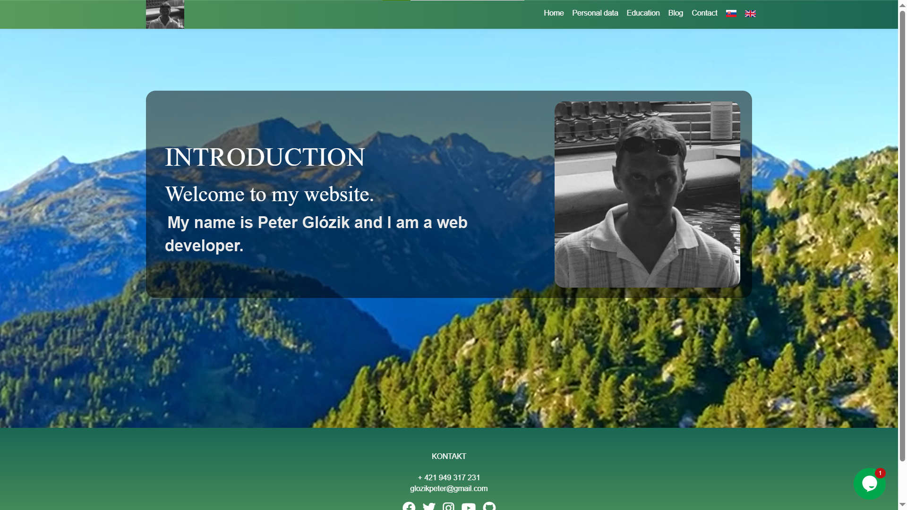
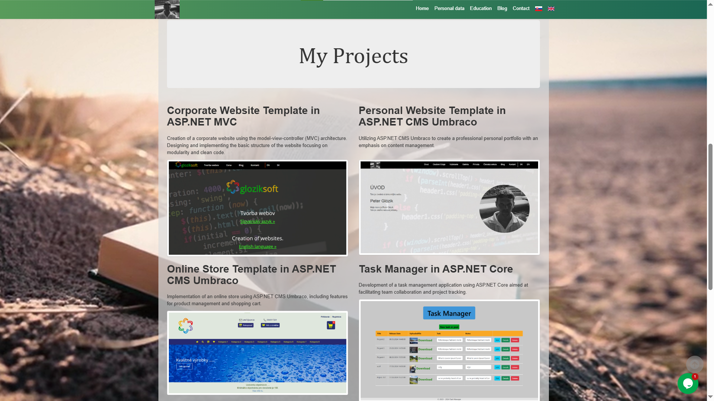

# Gloziksoft

👨‍💻 **Author:** Peter Glózik  
🎯 Junior Developer | 💡 Self-taught | 🎓 Currently in Java retraining

---

## 📖 Description

This is my personal portfolio website built with **Umbraco CMS**.  
It serves as a presentation of my work, a sandbox for learning, and a growing collection of projects as I build my career in software development.

🔗 **Live portfolio site**: [os.gloziksoft.sk](https://os.gloziksoft.sk)

---

## 👨‍💻 About Me

I am a **beginner developer**, currently attending a **Java retraining course**.  
I started with self-study, simple projects and continue to improve through practice and learning by doing.  
I regularly use both **Windows** and **Linux** as development environments.

---

## 🛠 Tools I Use

- **Visual Studio Code** – editing, web development  
- **Visual Studio Community** – .NET and ASP.NET development  
- **IntelliJ IDEA** – Java development  
- **MySQL** – managing databases and writing queries  
- **Microsoft SQL Server (SSMS)** – working with relational databases

---

## 🚀 Technologies & Skills

### ✅ I have basic knowledge of:
- **HTML / CSS / Bootstrap** – page structure, styling, responsiveness  
- **C# / .NET Framework** – basic syntax, OOP, building small applications  
- **ASP.NET MVC** – views, controllers, routing  
- **SQL** – writing queries, working with databases  
- **Git & GitHub** – version control, basic workflow

### 📚 Currently learning:
- **Java** – retraining course in progress  
- **ASP.NET Core** – building modern web apps  
- **JavaScript** – DOM, events, interactivity  
- **Umbraco CMS** – templating, content structure  
- **Entity Framework / LINQ** – data access in .NET

---

## 🖼 Preview

### 🔹 Homepage

### 🔹 My Projects

---

## 📁 Project Structure
\`\`\`
/Gloziksoft
├── README.md
└── [Project Files]
\`\`\`

---

## 🔗 Related Projects

Some of my other repositories:

- 🌐 [ASP.NET 4.8 MVC Business Site](https://github.com/Gloziksoft/Asp.Net-4.8-MVC-Business-site)  
- 🛒 [Eshop Gloziksoft](https://github.com/Gloziksoft/EshopGloziksoft)  
- ✅ [ASP.NET Core 7 MVC Task Manager](https://github.com/Gloziksoft/Asp.Net-Core-7-MVC-Task_Manager)  
- 🧱 [Umbraco Personal Website](https://github.com/Gloziksoft/PeterGlozikUmbracoOsobnaStranka)

---

## 📌 How to Run the Project

1. Clone the repository:
\`\`\`bash
git clone https://github.com/Gloziksoft/PeterGlozikUmbracoOsobnaStranka.git
\`\`\`

2. Open the project in **Visual Studio**  
3. Build and run the solution

---

## 💬 Feedback

If you find this project useful or interesting, feel free to **give it a ⭐ on GitHub**, fork it, or leave feedback.  
This portfolio shows where I currently am as a developer and how I continue to grow.
